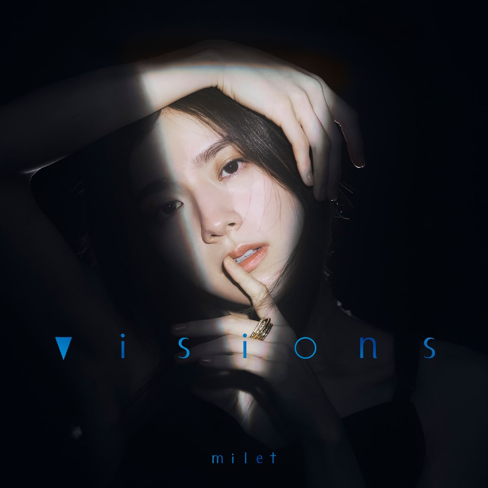

# SEVENTH HEAVEN

## milet (ミレイ)



词：milet

曲：milet/TomoLow

```
What are you waiting for waiting for waiting for?
你在等待什么 等待什么 等待什么?
Let me know 君の
让我知晓 在你的
カウントインで get it on turn it on kissの先を
计算之内 快开始吧 点燃火花 在留下一个吻之后
甘い夜がかけた魔法は
甜美的夜晚施下的魔法
ブラックホールの果て
被吸进黑洞的尽头
吸い込まれて 溶けて 混ぜて
逐渐溶化 混合为一
無制限のticket
留下这一张永无限制的车票
もう息もできないよunderground
令人难以呼吸的地铁
暗闇も run baby run babe
在黑暗之中也继续奔跑向前
無重力の night train
我会乘着无重力的夜间列车
迎えに行くから 窓開けて
前去迎接你 快点打开窗户
Run baby run baby 1 2 3
就这样一往无前吧 亲爱的
Sing it da da la da
高声歌唱
I want your love
我渴望你的爱
Sing it da da la da
高声歌唱
乗り過ごして dance all night
即便坐过了站 也要彻夜舞动
Sing it da da la da
高声歌唱
I want your love
我渴望你的爱
Sing it da da la da
高声歌唱
君がいれば alright
只要有你在便一切安好
Kiss me come closer come closer
与我接吻 靠近点吧 靠近点吧
'Cause our heaven is here
因为我们的天堂就在此
Kiss me come closer come closer
与我接吻 靠近点吧 靠近点吧
'Cause our heaven is here
因为我们的天堂就在此
Kiss me and come closer come closer
与我接吻 靠近点吧 靠近点吧
'Cause our heaven is here
因为我们的天堂就在此
Kiss me and come closer come closer
与我接吻 靠近点吧 靠近点吧
If you love me babe
若你爱我 宝贝
忘れさせてあげる
我会让你忘记
1秒前の名シーンも
一秒之前的名场面
アドリブだけ決めて笑って
只需即兴发挥 尽情欢笑
無計画 but who cares
毫无计划 但谁又在乎呢
もう息もできないよ underground
令人难以呼吸的地铁
行き先は run baby run babe
朝着目的地奔去吧 亲爱的
任せて night train
把一切交给我 抛开一切
全て捨てたら 飛び乗るの
跳上夜班列车
Run baby run baby 1 2 3
就这样一往无前吧 亲爱的
Sing it da da la da
高声歌唱
I want your love
我渴望你的爱
Sing it da da la da
高声歌唱
今欲しいの your love
现在我渴望的是 你的爱恋
Sing it da da la da
高声歌唱
I want your love
我渴望你的爱
Sing it da da la da
高声歌唱
君がいれば alright
只要有你在便一切安好
Kiss me come closer come closer
与我接吻 靠近点吧 靠近点吧
'Cause our heaven is here
因为我们的天堂就在此
Kiss me come closer come closer
与我接吻 靠近点吧 靠近点吧
'Cause our heaven is here
因为我们的天堂就在此
Kiss me and come closer come closer
与我接吻 靠近点吧 靠近点吧
'Cause our heaven is here
因为我们的天堂就在此
Kiss me and come closer come closer
与我接吻 靠近点吧 靠近点吧
If you love me babe
若你爱我 宝贝
CDG-CPT if you'll go
从巴黎戴高乐机场到开普敦国际机场 若你前往
TSA-LAX want more
从台北松山机场到洛杉矶国际机场 渴望更多
M-i-l-e-t I'm with ya
我会追随着你
YVR-ICN come on
从温哥华国际机场到仁川国际机场 来吧
RGN yah all day all night
仰光国际机场 整日整夜
All roads lead to here
所有道路通往
It's Tokyo
东京
My heaven yeah
我的天堂
Sing it da da la da
高声歌唱
I want your love
我渴望你的爱
Sing it da da la da
高声歌唱
今欲しいの your love
现在我渴望的是 你的爱恋
Sing it da da la da
高声歌唱
I want your love
我渴望你的爱
Sing it da da la da
高声歌唱
君がいれば alright
只要有你在便一切安好
Sing it da da la da
高声歌唱
I want your love
我渴望你的爱
Sing it da da la da
高声歌唱
乗り過ごし dance all night
即便坐过了站 也要彻夜舞动
Sing it da da la da
高声歌唱
I want your love
我渴望你的爱
Sing it da da la da
高声歌唱
君がいれば alright
只要有你在便一切安好
Sing it da da la da
高声歌唱
Kiss me come closer come closer
与我接吻 靠近点吧 靠近点吧
'Cause our heaven is here
因为我们的天堂就在此
Sing it da da la da
高声歌唱
Kiss me come closer come closer
与我接吻 靠近点吧 靠近点吧
'Cause our heaven is here
因为我们的天堂就在此
Sing it da da la da
高声歌唱
Kiss me come closer come closer
与我接吻 靠近点吧 靠近点吧
'Cause our heaven is here
因为我们的天堂就在此
Sing it da da la da
高声歌唱
Kiss me come closer come closer
与我接吻 靠近点吧 靠近点吧
If you love me babe
若你爱我 宝贝
```